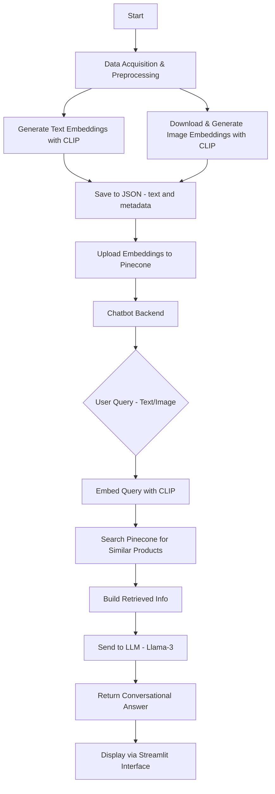

# Multimodal Product Search Solution

## 1. Implementation Overview

The solution implements a **multimodal product search engine**, combining **text and image embeddings** to facilitate comprehensive product retrieval. The core components include:

- Data preprocessing  
- Embedding generation  
- Vector database indexing  
- Streamlit-based chatbot interface for user interaction  

---

### 🔧 Key Implementation Steps

#### 📥 Data Acquisition and Preprocessing

- Handled in `evaluation_embeddings.ipynb`
- Downloads and preprocesses product data (e.g., Amazon Product Dataset 2020) using `kagglehub` and `pandas`
- Drops irrelevant columns, handles missing values
- Creates a combined description field per product

#### 🤖 Multimodal Embedding Generation

- Loads **CLIP model** (`openai/clip-vit-base-patch32`)
- **Text Embeddings**:
  - Enhanced text = product name + category + price + description + specs
  - Tokenized and embedded using CLIP text encoder
- **Image Embeddings**:
  - Images downloaded (with retries), processed, and encoded via CLIP image encoder
  - Supports multiple images per product
- Saves all embeddings + metadata to `embeddings/all_embeddings.json`

#### 📦 Vector Database (Pinecone) Indexing

- Embeddings uploaded to **Pinecone vector DB**
- Index name: `"multimodal"` (dimension: 512, metric: cosine)
- Embeddings formatted with:
  - Unique IDs (`product_id_text`, `product_id_img_i`)
  - Metadata (incl. `type` to distinguish text/image)
- Efficient batch upserts into Pinecone

#### 🧠 Chatbot Backend (`chatbot_backend.py`)

- Initializes Pinecone + loads CLIP model/processor
- `query_vector_db(query)`:
  - Generates embedding for user query (text/image)
  - Performs similarity search in Pinecone
  - Filters by type, builds product info string
  - Sends query + info to **LLM** (Perplexity AI’s Llama-3)
  - Returns conversational response

#### 🌐 Streamlit Web App (`app.py`)

- Provides UI for search chatbot
- Applies custom CSS (dark theme)
- Accepts text input + image upload
- Calls `query_vector_db()` to get product suggestions
- Displays results: product titles, descriptions, and images
- Link : https://uchicago-gen-ai.streamlit.app

#### 📊 Evaluation (`evaluation_embeddings.ipynb`)

- Evaluates retrieval performance (Recall@K) : 30% for text and 77% for images
- Works for both text and image queries
- Uses test ID samples against Pinecone index

